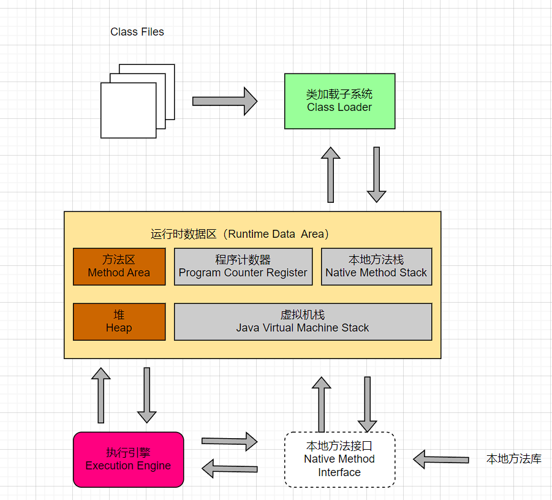
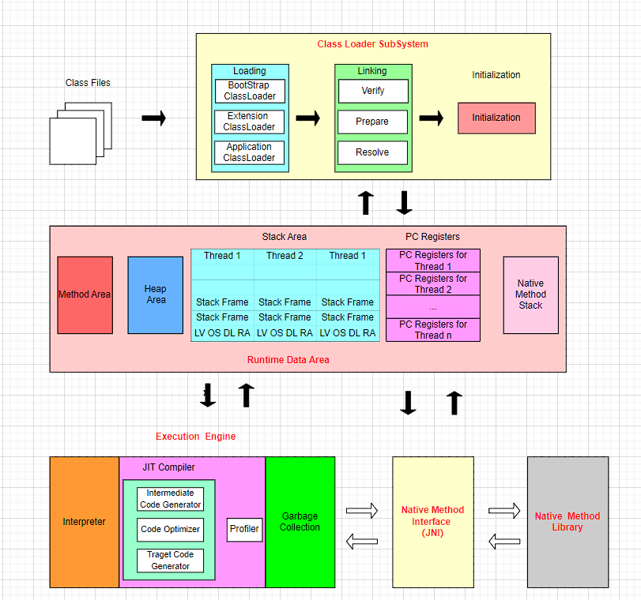
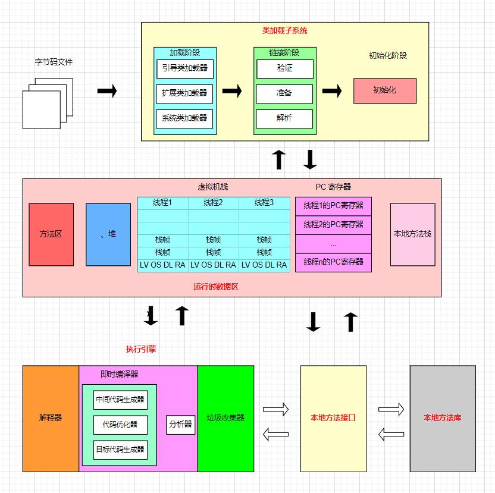
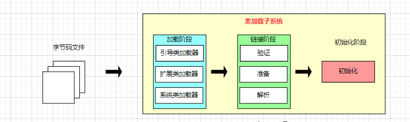
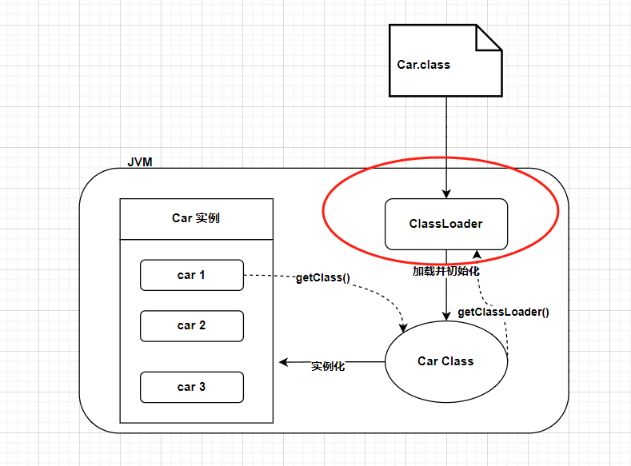
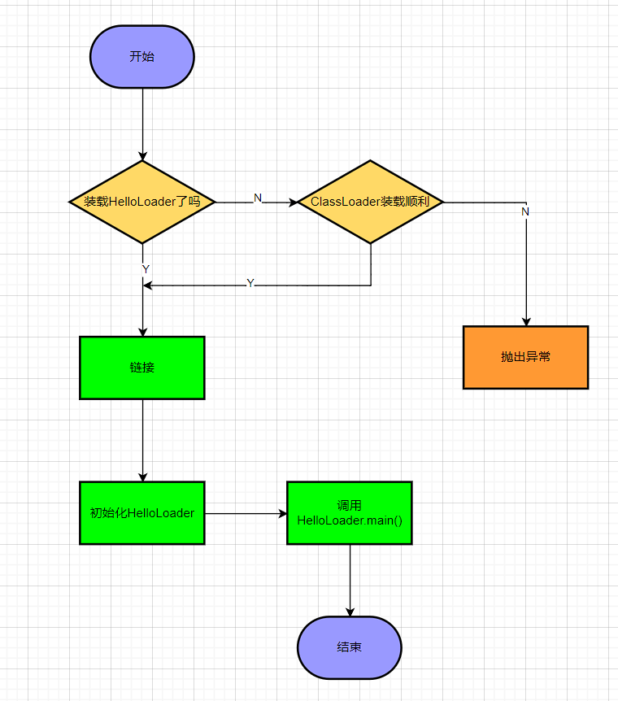
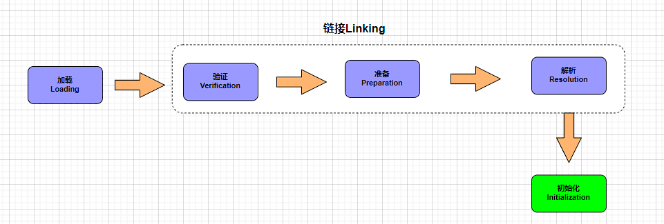
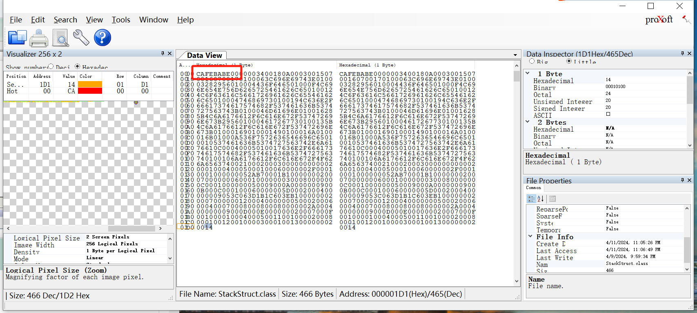

# 02_类加载子系统

## 内存结构概述

### 简图



### 详细图

#### 英文版



#### 中文版



注意：**方法区只有HotSpot虚拟机有，J9，JRockit都没有**

#### 如果自己想手写一个Java虚拟机的话，主要考虑哪些结构呢？

1. 类加载器
2. 执行引擎

## 类加载器与类加载过程

### 类加载器子系统



**类加载器子系统作用：**

1. 类加载器子系统负责从文件系统或者网络中加载Class文件，class文件在文件开头有特定的文件标识。
2. ClassLoader只负责class文件的加载，至于它是否可以运行，则由Execution Engine决定。
3. **加载的类信息存放于一块称为方法区的内存空间**。除了类的信息外，方法区中还会存放运行时常量池信息，可能还包括字符串字面量和数字常量（这部分常量信息是Class文件中常量池部分的内存映射）

### 类加载器ClassLoader角色



1. class file（在下图中就是Car.class文件）存在于本地硬盘上，可以理解为设计师画在纸上的模板，而最终这个模板在执行的时候是要加载到JVM当中来根据这个文件实例化出n个一模一样的实例。
2. class file加载到JVM中，被称为DNA元数据模板（在下图中就是内存中的Car Class），放在方法区。
3. 在.class文件–>JVM–>最终成为元数据模板，此过程就要一个运输工具（类装载器Class Loader），扮演一个快递员的角色。

### 类加载过程

```java
public class HelloLoader {

    public static void main(String[] args) {
        System.out.println("谢谢ClassLoader加载我....");
        System.out.println("你的大恩大德，我下辈子再报！");
    }
}
```



它的加载过程是怎么样的呢?

- 执行 main() 方法（静态方法）就需要先加载main方法所在类 HelloLoader
- 加载成功，则进行链接、初始化等操作。完成后调用 HelloLoader 类中的静态方法 main
- 加载失败则抛出异常

完整的流程图如下所示：



#### 加载阶段

**加载：**

1. 通过一个类的全限定名获取定义此类的二进制字节流
2. 将这个字节流所代表的静态存储结构转化为方法区的运行时数据结构
3. **在内存中生成一个代表这个类的java.lang.Class对象**，作为方法区这个类的各种数据的访问入口

**加载class文件的方式：**

1. 从本地系统中直接加载
2. 通过网络获取，典型场景：Web Applet
3. 从zip压缩包中读取，成为日后jar、war格式的基础
4. 运行时计算生成，使用最多的是：动态代理技术
5. 由其他文件生成，典型场景：JSP应用从专有数据库中提取.class文件，比较少见
6. 从加密文件中获取，典型的防Class文件被反编译的保护措施

#### 链接阶段

链接分为三个子阶段：验证 -> 准备 -> 解析

##### 验证(Verify)

1. 目的在于确保Class文件的字节流中包含信息符合当前虚拟机要求，保证被加载类的正确性，不会危害虚拟机自身安全
2. 主要包括四种验证，文件格式验证，元数据验证，字节码验证，符号引用验证。

**举例**

使用 BinaryViewer软件查看字节码文件，其开头均为 CAFE BABE ，如果出现不合法的字节码文件，那么将会验证不通过。



##### 准备(Prepare)

1. 为类变量（static变量）分配内存并且设置该类变量的默认初始值，即零值
2. 这里不包含用final修饰的static，因为final在编译的时候就会分配好了默认值，准备阶段会显式初始化
3. 注意：这里不会为实例变量分配初始化，类变量会分配在方法区中，而实例变量是会随着对象一起分配到Java堆中

**举例**

代码：变量a在准备阶段会赋初始值，但不是1，而是0，在初始化阶段会被赋值为 1

```java
public class HelloApp {
    private static int a = 1;//prepare：a = 0 ---> initial : a = 1


    public static void main(String[] args) {
        System.out.println(a);
    }
}
```

##### 解析(Resolve)

1. **将常量池内的符号引用转换为直接引用的过程**
2. 事实上，解析操作往往会伴随着JVM在执行完初始化之后再执行
3. 符号引用就是一组符号来描述所引用的目标。符号引用的字面量形式明确定义在《java虚拟机规范》的class文件格式中。直接引用就是直接指向目标的指针、相对偏移量或一个间接定位到目标的句柄
4. 解析动作主要针对类或接口、字段、类方法、接口方法、方法类型等。对应常量池中的CONSTANT Class info、CONSTANT Fieldref info、CONSTANT Methodref info等