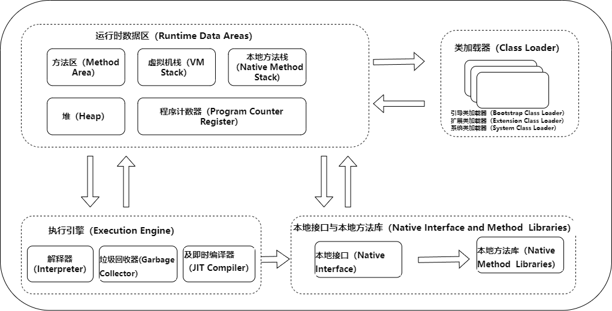
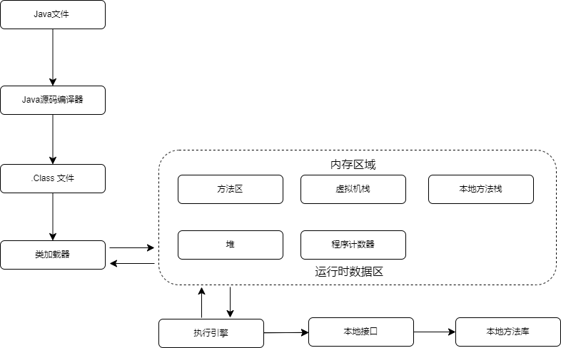

## 说一下 JVM 的主要组成部分及其作用？

Java虚拟机（JVM）是运行所有Java应用程序的引擎。它是一个虚拟的计算机设备，为Java应用程序提供了一个跨平台的运行环境。JVM的主要组成部分及其作用可以总结如下：

### 1. 类加载器（Class Loader）

类加载器负责从文件系统、网络或其他来源加载类信息到JVM中。它在运行时将Java类的`.class`文件加载到内存中，并为这些类生成对应的`java.lang.Class`对象。类加载器主要分为三种：

- **引导类加载器（Bootstrap Class Loader）**：它加载Java的核心库（JAVA_HOME/jre/lib/rt.jar里面的类或者是其他的一些基础类库）。
- **扩展类加载器（Extension Class Loader）**：它负责加载JAVA_HOME/jre/lib/ext目录中或者由java.ext.dirs系统属性指定位置中的类库。
- **系统（应用）类加载器（System Class Loader）**：它根据Java应用的类路径（CLASSPATH）来加载Java类。

### 2. 运行时数据区（Runtime Data Areas）

运行时数据区是JVM在运行Java程序时用来存储数据的内存区域，它包括以下几个主要部分：

- **方法区（Method Area）**：存储每一个类的结构信息，如运行时常量池（Runtime Constant Pool）、字段和方法数据、构造函数和普通方法的代码等。
- **堆（Heap）**：是JVM管理的最大的一块内存区域，用于存储所有的对象实例及数组。堆是垃圾收集器管理的主要区域，因此也被称为“垃圾收集堆”。
- **虚拟机栈（VM Stack）**：每个线程在JVM中都有自己的栈，用于存储局部变量和部分结果，并在方法调用和返回时播放这些信息。每个栈帧中都包含局部变量表、操作数栈、动态链接和方法返回地址等信息。
- **程序计数器（Program Counter Register）**：当前线程所执行的字节码的行号指示器。
- **本地方法栈（Native Method Stack）**：为JVM使用到的Native方法服务。

### 3. 执行引擎（Execution Engine）

责执行由编译器生成的字节码指令。执行引擎读取字节码，解释执行或直接编译成本地机器码执行，确保Java程序能够在不同的硬件平台上运行。

-  **解释器（Interpreter）**：当Java虚拟机启动时，解释器负责将字节码逐条转换成机器码并执行。这个过程是逐条解释执行，因此效率相对较低，特别是对于循环和频繁调用的方法。

- **即时编译器（Just-In-Time Compiler, JIT Compiler）**：为了提高性能，JVM引入了即时编译器。JIT编译器能够在程序运行时将字节码编译成本地机器码，并进行各种优化。通过编译成本地代码，JIT可以显著提高Java程序的执行速度。JIT编译器还具备方法内联、循环展开等优化技术，进一步提高执行效率。

-  **垃圾回收器（Garbage Collector）**：虽然严格来说垃圾回收器不属于执行引擎的直接组成部分，但它在执行过程中起着至关重要的角色，负责管理Java堆内存，自动监测和识别那些不再被使用的对象，并回收它们的内存空间。

### 4. 本地接口与本地方法库（Native Interface and Method  Libraries）

​	在Java虚拟机（JVM）的上下文中，本地接口与本地库（Native Interface and Native Libraries）提供了一种机制，使得Java程序能够与在本地机器上用其他语言（如C或C++）编写的代码进行交互。这主要通过Java本地接口（Java Native Interface，JNI）实现，它是一个标准编程接口，属于JVM的一部分。JNI不仅允许Java代码中的方法调用本地方法（即在本地代码中实现的方法），还允许本地代码使用Java对象、调用Java方法以及处理Java对象。

- **本地接口（Native Interface）**：JNI是Java提供的一套标准API，它定义了Java代码与本地代码之间互相通信的方式。JNI允许开发者在Java应用程序中声明本地方法（native methods），这些方法是用其他语言如C或C++实现的，然后在Java代码中加载和使用这些本地方法。通过JNI，开发者可以实现一些Java本身无法直接实现的底层操作，如系统级别的操作和对特定硬件的直接控制。
- **本地方法库（Native Method   Libraries）**：这些是具体实现了本地方法的编译过的代码库，通常是用C或C++等语言编写并编译成平台特定的动态链接库（如Windows上的DLL文件，Linux上的.so文件）。当Java程序调用一个本地方法时，JVM使用JNI来加载包含这个本地方法实现的本地库，并执行其中的代码。

### 总结

JVM 是 Java 语言的核心，它为 Java 程序提供了运行环境。JVM 的主要组成部分包括类加载器、执行引擎、运行时数据区和本地库接口。这些组成部分共同协作，实现了 Java 程序的执行。

​	首先通过编译器把 Java 代码转换成字节码，类加载器（ClassLoader）再把字节码加载到内存中，将其放在运行时数据区（Runtime data area）的方 法区内，而字节码文件只是 JVM的一套指令集规范，并不能直接交给底层操作系统去执行，因此需要特定的命令解析器执行引擎（ExecutionEngine），将 字节码翻译成底层系统指令，再交由 CPU 去执行，而这个过程中需要调用其他 语言的本地库接口（Native Interface）来实现整个程序的功能。

以下是 JVM 主要组成部分及其作用的简要总结：

| 组成部分     | 作用                                   |
| :----------- | :------------------------------------- |
| 类加载器     | 加载 Java 类文件到内存中               |
| 执行引擎     | 解释和执行 Java 字节码                 |
| 运行时数据区 | 存储 Java 程序运行时的数据             |
| 本地库接口   | 提供 Java 程序与本地代码进行交互的接口 |

### **Java**程序运行机制详细说明

类的加载指的是将类的.class文件中的二进制数据读入到内存中，将其放在运行时数据区的方法区内，然后在堆区创建一个 java.lang.Class对象，用来封装类在方法区内的数据结构。

## **说一下** **JVM** **运行时数据区**

不同虚拟机的运行时数据区可能略微有所不同，但都会遵从 Java 虚拟机规范， Java 虚拟机规范规定的

区域分为以下 5 个部分：

**程序计数器（Program Counter Register）**：当前线程所执行的字节码的行号 指示器，字节码解析器的工作是通过改变这个计数器的值，来选取下一条需要执行的 字节码指令，分支、循环、跳转、异常处理、线程恢复等基础功能，都需要依赖这个计数器来完成；

**Java 虚拟机栈（Java Virtual Machine Stacks）**：用于存储局部变量表、操作 数栈、动态链接、方法出口等信息；

**本地方法栈（Native Method Stack）**：与虚拟机栈的作用是一样的，只不过虚拟机栈是服务 Java方法的，而本地方法栈是为虚拟机调用 Native 方法服务的；

**Java 堆（Java Heap）**：Java 虚拟机中内存大的一块，是被所有线程共享 的，几乎所有的对象实例都在这里分配内存；

**方法区（Methed Area）**：用于存储已被虚拟机加载的类信息、常量、静态变 量、即时编译后的代码等数据。

## 说一下堆栈的区别？

堆（Heap）和栈（Stack）在计算机科学中是用来存储数据的两种重要的内存区域，它们在管理数据的方式、目的和使用场景上有着本质的区别。下面分别介绍堆和栈的特点以及它们之间的主要区别：

### 堆（Heap）

- **动态分配**：堆用于存储动态分配的对象。无论何时我们创建一个对象，它都会被存储在堆内存中。
- **生命周期**：堆内存中对象的生命周期不必随着方法结束而结束，对象会保留在内存中直到没有任何引用指向它时，垃圾收集器才会清理它。
- **访问速度**：相比于栈，堆内存的访问速度较慢。
- **大小和限制**：堆的大小通常远大于栈，但是如果堆空间被全部用完，会抛出`OutOfMemoryError`。
- **共享**：堆是所有线程共享的一块区域，这意味着在堆上分配的对象可以被程序中所有线程访问。

### 栈（Stack）

- **自动管理**：栈用于存储局部变量和方法调用。当一个方法被调用时，一个新的栈帧会被创建并压入调用线程的栈中，方法结束时，栈帧被销毁。
- **生命周期**：存储在栈上的数据的生命周期通常随着方法调用的开始和结束而开始和结束。
- **访问速度**：栈内存可以快速访问，比堆内存的访问速度快。
- **大小和限制**：栈的大小相对较小，并且每个线程都有自己的栈。栈空间如果被耗尽（通常是由于过深的递归导致），会抛出`StackOverflowError`。
- **线程隔离**：每个线程都有自己的栈，不同线程之间的栈是不共享的。

### 主要区别总结

1. **管理方式**：堆是动态分配的，栈是自动管理的。
2. **生命周期**：堆中对象的生命周期可以跨方法调用，而栈中的数据生命周期通常随着方法的结束而结束。
3. **访问速度**：栈的访问速度比堆快。
4. **内存大小**：堆的大小一般比栈大，适用于存储大量的数据和动态分配的对象。
5. **数据共享**：堆内存是线程共享的，而栈内存是线程隔离的。

## 深拷贝和浅拷贝的区别 

深拷贝和浅拷贝是编程中常见的两种对象复制方式，它们在复制对象时对对象内部的引用类型成员的处理方式上存在本质的区别。

### 浅拷贝（Shallow Copy）

浅拷贝仅复制对象的顶层结构，对于对象内部的引用类型成员，浅拷贝不会创建新的实例，而是将引用直接复制过来。这意味着，如果原始对象和拷贝对象中的某个引用类型成员指向同一个对象，那么这两个对象中的引用类型成员实际上指向的是内存中的同一个位置。因此，修改任一对象的该引用类型成员都会影响到另一个对象。

### 深拷贝（Deep Copy）

深拷贝不仅复制对象的顶层结构，还会递归地复制对象内部所有引用类型成员所指向的对象。这意味着，复制过程中会创建一份原对象内部所有被引用对象的副本。因此，原始对象和拷贝对象在内存中是完全独立的，修改任一对象的引用类型成员不会影响到另一个对象。

### 区别总结

- **复制深度**：浅拷贝只复制一层对象，深拷贝会递归复制所有层。
- **对引用类型成员的处理**：浅拷贝中的引用类型成员仍然指向原始对象中相同的内存地址，而深拷贝会为这些成员分配新的内存地址。
- **复制后的独立性**：浅拷贝得到的对象与原始对象在引用类型成员上共享内存，深拷贝得到的对象在所有层次上都是独立的。
- **性能和资源消耗**：浅拷贝由于只复制对象的顶层结构，所以比深拷贝更快，消耗的资源也更少。深拷贝由于需要递归复制所有引用类型成员，因此在复制大型或复杂对象时可能会比较耗时和消耗更多的内存。

## 队列和栈是什么？有什么区别？

队列（Queue）和栈（Stack）都是基本的数据结构，用于存储和管理数据。它们的主要区别在于数据的存取方式，即数据的添加和删除操作遵循的规则不同。

### 队列（Queue）

队列是一种遵循先进先出（FIFO, First-In-First-Out）原则的数据结构。在队列中，元素从一端（通常称为“队尾”）添加，从另一端（通常称为“队头”）移除。想象一下排队买票，第一个排队的人将是第一个买到票并离开队列的人。这种结构使得队列非常适合于任务调度和资源共享的场景。

### 栈（Stack）

栈是一种遵循后进先出（LIFO, Last-In-First-Out）原则的数据结构。在栈中，元素被添加到顶部，并且只有顶部的元素才可以被移除。这就像一叠盘子，你只能取走最上面的一盘，而添加新盘子时也只能放在顶部。栈的这种特性使其非常适合于解决如递归算法、后缀表达式求值、回溯算法等问题。

### 主要区别

1. **数据操作的顺序**：
   - 队列遵循先进先出原则。
   - 栈遵循后进先出原则。
2. **功能**：
   - 队列用于在不同的时间管理数据项，模拟排队行为。
   - 栈用于提供访问集合的一种方式，主要用于解决递归、搜索和排序问题。
3. **使用场景**：
   - 队列常用于数据的顺序处理，如操作系统中的任务调度，打印队列等。
   - 栈常用于具有嵌套结构的情况，如编程语言中的函数调用、括号匹配检查、页面访问历史（浏览器后退功能）等。
4. **数据访问**：
   - 在队列中，添加操作在一端进行，而移除操作在另一端进行。
   - 在栈中，添加和移除操作都在同一端进行。