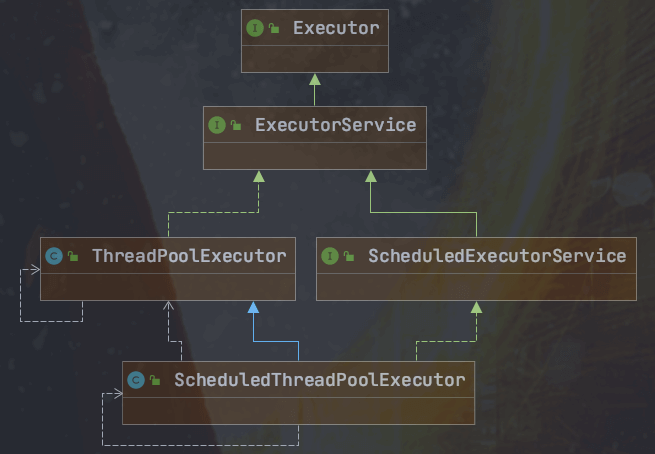
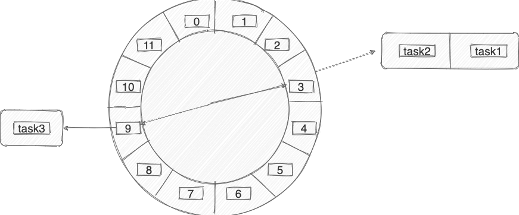
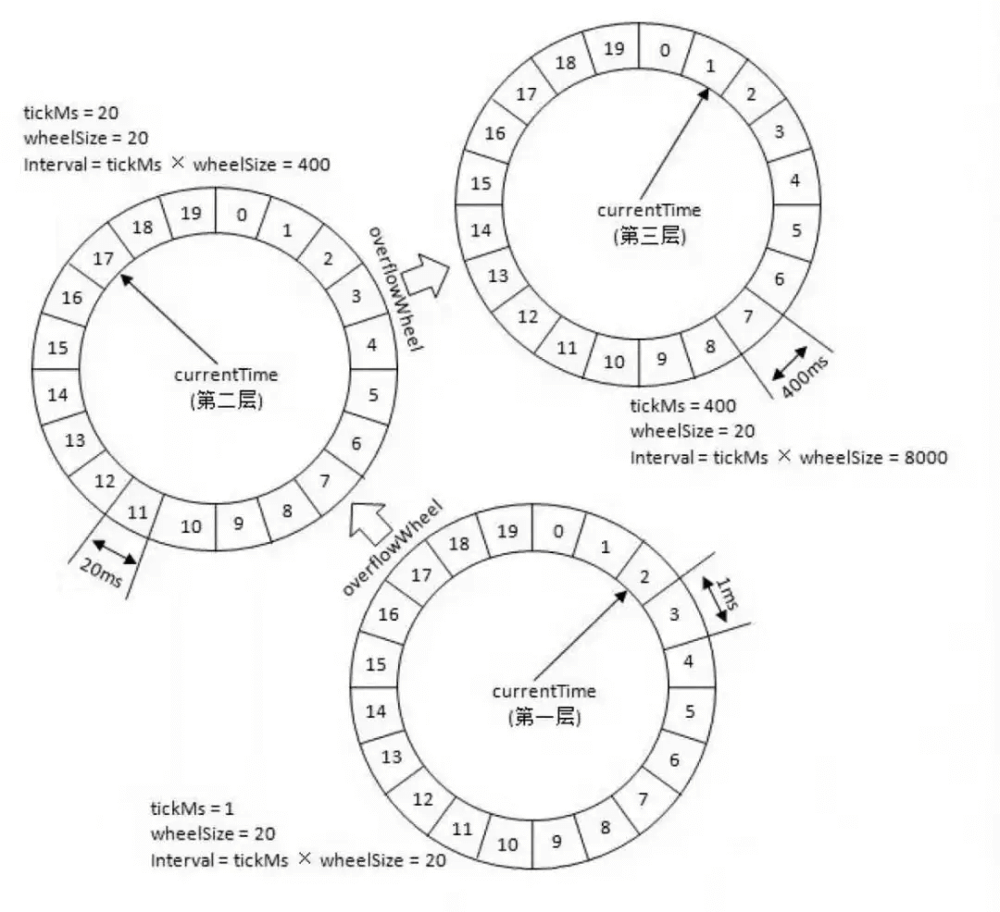

# Java 定时任务实现思路
## 为什么需要定时任务？
我们来看一下几个非常常见的业务场景：
1. 某系统凌晨 1 点要进行数据备份。
2. 某电商平台，用户下单半个小时未支付的情况下需要自动取消订单。
3. 某媒体聚合平台，每 10 分钟动态抓取某某网站的数据为自己所用。
4. 某博客平台，支持定时发送文章。
5. 某基金平台，每晚定时计算用户当日收益情况并推送给用户最新的数据。
6. ……
这些场景往往都要求我们在某个特定的时间去做某个事情，也就是定时或者延时去做某个事情。
+ 定时任务：在指定时间点执行特定的任务，例如每天早上 8 点，每周一下午 3 点等。定时任务可以用来做一些周期性的工作，如数据备份，日志清理，报表生成等。
+ 延时任务：一定的延迟时间后执行特定的任务，例如 10 分钟后，3 小时后等。延时任务可以用来做一些异步的工作，如订单取消，推送通知，红包撤回等。
尽管二者的适用场景有所区别，但它们的核心思想都是将任务的执行时间安排在未来的某个点上，以达到预期的调度效果。
## 单机定时任务
### Timer
`java.util.Timer`是 JDK 1.3 开始就已经支持的一种定时任务的实现方式。
`Timer` 内部使用一个叫做 `TaskQueue` 的类存放定时任务，它是一个基于最小堆实现的优先级队列。`TaskQueue` 会按照任务距离下一次执行时间的大小将任务排序，保证在堆顶的任务最先执行。这样在需要执行任务时，每次只需要取出堆顶的任务运行即可！
`Timer` 使用起来比较简单，通过下面的方式我们就能创建一个 1s 之后执行的定时任务。
```java
@Test
public void test01() throws InterruptedException {
    TimerTask task = new TimerTask() {
        public void run() {
            System.out.println("当前时间: " + new Date() +
                    " 线程名称: " + Thread.currentThread().getName());
        }
    };
    System.out.println("当前时间: " + new Date() +
            " 线程名称: " + Thread.currentThread().getName());
    Timer timer = new Timer("Timer");
    long delay = 1000L;
    timer.schedule(task, delay);
    Thread.sleep(2000);
}
当前时间: Wed Aug 28 15:54:17 GMT+08:00 2024 线程名称: main
当前时间: Wed Aug 28 15:54:18 GMT+08:00 2024 线程名称: Timer
```
不过其缺陷较多，比如一个 `Timer` 一个线程，这就导致 `Timer` 的任务的执行只能串行执行，一个任务执行时间过长的话会影响其他任务（性能非常差），再比如发生异常时任务直接停止（`Timer` 只捕获了 `InterruptedException` ）。
`Timer` 类上的有一段注释是这样写的：
```javascript
* This class does not offer real-time guarantees: it schedules
  * tasks using the <tt>Object.wait(long)</tt> method.
  *Java 5.0 introduced the {@code java.util.concurrent} package and
  * one of the concurrency utilities therein is the {@link
  * java.util.concurrent.ScheduledThreadPoolExecutor
  * ScheduledThreadPoolExecutor} which is a thread pool for repeatedly
  * executing tasks at a given rate or delay.  It is effectively a more
  * versatile replacement for the {@code Timer}/{@code TimerTask}
  * combination, as it allows multiple service threads, accepts various
  * time units, and doesn't require subclassing {@code TimerTask} (just
  * implement {@code Runnable}).  Configuring {@code
  * ScheduledThreadPoolExecutor} with one thread makes it equivalent to
  * {@code Timer}.
```
大概的意思就是：`ScheduledThreadPoolExecutor` 支持多线程执行定时任务并且功能更强大，是 `Timer` 的替代品。
### ScheduledExecutorService
`ScheduledExecutorService` 是一个接口，有多个实现类，比较常用的是 `ScheduledThreadPoolExecutor` 。

`ScheduledThreadPoolExecutor` 本身就是一个线程池，支持任务并发执行。并且，其内部使用 `DelayedWorkQueue` 作为任务队列。
```java
@Test
public void test02() throws InterruptedException {
    TimerTask repeatedTask = new TimerTask() {
        @SneakyThrows
        public void run() {
            System.out.println("当前时间: " + new Date() +
                    " 线程名称: " + Thread.currentThread().getName());
        }
    };
    System.out.println("当前时间: " + new Date() +
            " 线程名称: " + Thread.currentThread().getName());
    ScheduledExecutorService executor = Executors.newScheduledThreadPool(3);
    long delay  = 1000L;
    long period = 1000L;
    executor.scheduleAtFixedRate(repeatedTask, delay, period, TimeUnit.MILLISECONDS);
    Thread.sleep(delay + period * 5);
    executor.shutdown();
}
当前时间: Wed Aug 28 16:01:45 GMT+08:00 2024 线程名称: main
当前时间: Wed Aug 28 16:01:46 GMT+08:00 2024 线程名称: pool-2-thread-1
当前时间: Wed Aug 28 16:01:47 GMT+08:00 2024 线程名称: pool-2-thread-1
当前时间: Wed Aug 28 16:01:48 GMT+08:00 2024 线程名称: pool-2-thread-2
当前时间: Wed Aug 28 16:01:49 GMT+08:00 2024 线程名称: pool-2-thread-1
当前时间: Wed Aug 28 16:01:50 GMT+08:00 2024 线程名称: pool-2-thread-1
当前时间: Wed Aug 28 16:01:51 GMT+08:00 2024 线程名称: pool-2-thread-1
```
不论是使用 `Timer` 还是 `ScheduledExecutorService` 都无法使用 Cron 表达式指定任务执行的具体时间。
### DelayQueue
`DelayQueue` 是 JUC 包(`java.util.concurrent)`为我们提供的延迟队列，用于实现延时任务比如订单下单 15 分钟未支付直接取消。它是 `BlockingQueue` 的一种，底层是一个基于 `PriorityQueue` 实现的一个无界队列，是线程安全的。

BlockingQueue 的实现类
`DelayQueue` 和 `Timer/TimerTask` 都可以用于实现定时任务调度，但是它们的实现方式不同。`DelayQueue` 是基于优先级队列和堆排序算法实现的，可以实现多个任务 按照时间先后顺序执行；而 `Timer/TimerTask` 是基于单线程实现的，只能按照任务的执行顺序依次执行，如果某个任务执行时间过长，会影响其他任务的执行。另外，`DelayQueue` 还支持动态添加和移除任务，而 `Timer/TimerTask` 只能在创建时指定任务。
### Spring Task
我们直接通过 Spring 提供的 `@Scheduled` 注解即可定义定时任务，非常方便！
```java
/**
 * cron：使用Cron表达式，每天中午12点触发
 */
@Scheduled(cron = "0 0 12 * * ? ")
public void test03() {
    
}
```
Spring Task 还是支持 **Cron 表达式** 的。Cron 表达式主要用于定时作业(定时任务)系统定义执行时间或执行频率的表达式，非常厉害，你可以通过 Cron 表达式进行设置定时任务每天或者每个月什么时候执行等等操作。
咱们要学习定时任务的话，Cron 表达式是一定是要重点关注的。
推荐一个在线 Cron 表达式生成器：[http://cron.qqe2.com/open in new window](http://cron.qqe2.com/) 。
**补充： Spring Task 底层是基于 JDK 的 **`**ScheduledThreadPoolExecutor**`** 线程池来实现的。**
**优缺点总结：**
+ 优点：简单，轻量，支持 Cron 表达式
+ 缺点：功能单一
### 时间轮
Kafka、Dubbo、ZooKeeper、Netty、Caffeine、Akka 中都有对时间轮的实现。
时间轮简单来说就是一个环形的队列（底层一般基于数组实现），队列中的每一个元素（时间格）都可以存放一个定时任务列表。
时间轮中的每个时间格代表了时间轮的基本时间跨度或者说时间精度，假如时间一秒走一个时间格的话，那么这个时间轮的最高精度就是 1 秒（也就是说 3 s 和 3.9s 会在同一个时间格中）。
下图是一个有 12 个时间格的时间轮，转完一圈需要 12 s。当我们需要新建一个 3s 后执行的定时任务，只需要将定时任务放在下标为 3 的时间格中即可。
当我们需要新建一个 9s 后执行的定时任务，只需要将定时任务放在下标为 9 的时间格中即可。

那当我们需要创建一个 13s 后执行的定时任务怎么办呢？这个时候可以引入一叫做 **圈数/轮数** 的概念，也就是说这个任务还是放在下标为 1 的时间格中， 不过它的圈数为 2 。
除了增加圈数这种方法之外，还有一种 **多层次时间轮** （类似手表），Kafka 采用的就是这种方案。
针对下图的时间轮，我来举一个例子便于大家理解。

上图的时间轮(ms -> s)，第 1 层的时间精度为 1 ，第 2 层的时间精度为 20 ，第 3 层的时间精度为 400。
假如我们需要添加一个 350s 后执行的任务 A 的话（当前时间是 0s），这个任务会被放在第 2 层（因为第二层的时间跨度为 20*20=400>350）的第 350/20=17 个时间格子。
当第一层转了 17 圈之后，时间过去了 340s ，第 2 层的指针此时来到第 17 个时间格子。此时，第 2 层第 17 个格子的任务会被移动到第 1 层。
任务 A 当前是 10s 之后执行，因此它会被移动到第 1 层的第 10 个时间格子。
这里在层与层之间的移动也叫做时间轮的升降级。参考手表来理解就好！
**时间轮比较适合任务数量比较多的定时任务场景，它的任务写入和执行的时间复杂度都是 0（1）。**
## 分布式定时任务
### Redis
Redis 是可以用来做延时任务的，基于 Redis 实现延时任务的功能无非就下面两种方案：
1. Redis 过期事件监听
2. Redisson 内置的延时队列
### MQ
大部分消息队列，例如 RocketMQ、RabbitMQ，都支持定时/延时消息。定时消息和延时消息本质其实是相同的，都是服务端根据消息设置的定时时间在某一固定时刻将消息投递给消费者消费。
不过，在使用 MQ 定时消息之前一定要看清楚其使用限制，以免不适合项目需求，例如 RocketMQ 开源版定时时长最大值默认为 24 小时且不支持自定义修改、只支持 18 个 Level 的延时并不支持任意时间。
**优缺点总结：**
+ **优点**：可以与 Spring 集成、支持分布式、支持集群、性能不错
+ **缺点**：功能性较差、不灵活、需要保障消息可靠性
## 分布式任务调度框架
如果我们需要一些高级特性比如支持任务在分布式场景下的分片和高可用的话，我们就需要用到分布式任务调度框架了。
通常情况下，一个分布式定时任务的执行往往涉及到下面这些角色：
+ **任务**：首先肯定是要执行的任务，这个任务就是具体的业务逻辑比如定时发送文章。
+ **调度器**：其次是调度中心，调度中心主要负责任务管理，会分配任务给执行器。
+ **执行器**：最后就是执行器，执行器接收调度器分派的任务并执行。
### Quartz
一个很火的开源任务调度框架，完全由 Java 写成。Quartz 可以说是 Java 定时任务领域的老大哥或者说参考标准，其他的任务调度框架基本都是基于 Quartz 开发的，比如当当网的`elastic-job`就是基于 Quartz 二次开发之后的分布式调度解决方案。
使用 Quartz 可以很方便地与 Spring 集成，并且支持动态添加任务和集群。但是，Quartz 使用起来也比较麻烦，API 繁琐。
另外，Quartz 虽然也支持分布式任务。但是，它是在数据库层面，通过数据库的锁机制做的，有非常多的弊端比如系统侵入性严重、节点负载不均衡。有点伪分布式的味道。
**优缺点总结：**
+ 优点：可以与 Spring 集成，并且支持动态添加任务和集群。
+ 缺点：分布式支持不友好，不支持任务可视化管理、使用麻烦（相比于其他同类型框架来说）
### Elastic-Job
ElasticJob 当当网开源的一个面向互联网生态和海量任务的分布式调度解决方案，由两个相互独立的子项目 ElasticJob-Lite 和 ElasticJob-Cloud 组成。
ElasticJob-Lite 和 ElasticJob-Cloud 两者的对比如下：
| | ElasticJob-Lite | ElasticJob-Cloud |
| --- | :--- | --- |
| 无中心化 | 是 | 否 |
| 资源分配 | 不支持 | 支持 |
| 作业模式 | 常驻 | 常驻 + 瞬时 |
| 部署依赖 | ZooKeeper | ZooKeeper + Mesos |
`ElasticJob` 支持任务在分布式场景下的分片和高可用、任务可视化管理等功能。
ElasticJob-Lite 的架构设计如下图所示：

从上图可以看出，Elastic-Job 没有调度中心这一概念，而是使用 ZooKeeper 作为注册中心，注册中心负责协调分配任务到不同的节点上。
Elastic-Job 中的定时调度都是由执行器自行触发，这种设计也被称为去中心化设计（调度和处理都是执行器单独完成）。
```java
@Component
@ElasticJobConf(name = "dayJob", cron = "0/10 * * * * ?", shardingTotalCount = 2,
                shardingItemParameters = "0=AAAA,1=BBBB", description = "简单任务", failover = true)
public class TestJob implements SimpleJob {
    @Override
    public void execute(ShardingContext shardingContext) {
        log.info("TestJob任务名：【{}】, 片数：【{}】, param=【{}】", shardingContext.getJobName(), shardingContext.getShardingTotalCount(),
                 shardingContext.getShardingParameter());
    }
}
```
**相关地址：**
+ GitHub 地址：[https://github.com/apache/shardingsphere-elasticjob。open in new window](https://github.com/apache/shardingsphere-elasticjob%E3%80%82)
+ 官方网站：[https://shardingsphere.apache.org/elasticjob/index_zh.htmlopen in new window](https://shardingsphere.apache.org/elasticjob/index_zh.html)
**优缺点总结：**
+ 优点：可以与 Spring 集成、支持分布式、支持集群、性能不错、支持任务可视化管理
+ 缺点：依赖了额外的中间件比如 Zookeeper（复杂度增加，可靠性降低、维护成本变高）
### XXL-JOB
`XXL-JOB` 于 2015 年开源，是一款优秀的轻量级分布式任务调度框架，支持任务可视化管理、弹性扩容缩容、任务失败重试和告警、任务分片等功能，
根据 `XXL-JOB` 官网介绍，其解决了很多 Quartz 的不足。
> Quartz 作为开源作业调度中的佼佼者，是作业调度的首选。但是集群环境中 Quartz 采用 API 的方式对任务进行管理，从而可以避免上述问题，但是同样存在以下问题：
>
> + 问题一：调用 API 的的方式操作任务，不人性化；
> + 问题二：需要持久化业务 QuartzJobBean 到底层数据表中，系统侵入性相当严重。
> + 问题三：调度逻辑和 QuartzJobBean 耦合在同一个项目中，这将导致一个问题，在调度任务数量逐渐增多，同时调度任务逻辑逐渐加重的情况下，此时调度系统的性能将大大受限于业务；
> + 问题四：quartz 底层以“抢占式”获取 DB 锁并由抢占成功节点负责运行任务，会导致节点负载悬殊非常大；而 XXL-JOB 通过执行器实现“协同分配式”运行任务，充分发挥集群优势，负载各节点均衡。
>
> XXL-JOB 弥补了 quartz 的上述不足之处。
>
`XXL-JOB` 的架构设计如下图所示：

从上图可以看出，`XXL-JOB` 由 **调度中心** 和 **执行器** 两大部分组成。调度中心主要负责任务管理、执行器管理以及日志管理。执行器主要是接收调度信号并处理。另外，调度中心进行任务调度时，是通过自研 RPC 来实现的。
不同于 Elastic-Job 的去中心化设计， `XXL-JOB` 的这种设计也被称为中心化设计（调度中心调度多个执行器执行任务）。
和 `Quzrtz` 类似 `XXL-JOB` 也是基于数据库锁调度任务，存在性能瓶颈。不过，一般在任务量不是特别大的情况下，没有什么影响的，可以满足绝大部分公司的要求。
不要被 `XXL-JOB` 的架构图给吓着了，实际上，我们要用 `XXL-JOB` 的话，只需要重写 `IJobHandler` 自定义任务执行逻辑就可以了，非常易用！
```java
@JobHandler(value="testApiJobHandler")
@Component
public class TestApiJobHandler extends IJobHandler {
    @Override
    public ReturnT<String> execute(String param) throws Exception {
        //......
        return ReturnT.SUCCESS;
    }
}
```
还可以直接基于注解定义任务。
```java
@XxlJob("testAnnotationJobHandler")
public ReturnT<String> testAnnotationJobHandler(String param) throws Exception {
    //......
    return ReturnT.SUCCESS;
}
```
**相关地址：**
+ GitHub 地址：[https://github.com/xuxueli/xxl-job/。open in new window](https://github.com/xuxueli/xxl-job/%E3%80%82)
+ 官方介绍：[https://www.xuxueli.com/xxl-job/open in new window](https://www.xuxueli.com/xxl-job/)
**优缺点总结：**
+ 优点：开箱即用（学习成本比较低）、与 Spring 集成、支持分布式、支持集群、支持任务可视化管理。
+ 缺点：不支持动态添加任务。
### PowerJob
非常值得关注的一个分布式任务调度框架，分布式任务调度领域的新星。目前，已经有很多公司接入比如 OPPO、京东、中通、思科。
这个框架的诞生也挺有意思的，PowerJob 的作者当时在阿里巴巴实习过，阿里巴巴那会使用的是内部自研的 SchedulerX（阿里云付费产品）。实习期满之后，PowerJob 的作者离开了阿里巴巴。想着说自研一个 SchedulerX，防止哪天 SchedulerX 满足不了需求，于是 PowerJob 就诞生了。
PowerJob 官方也对比过其和 QuartZ、XXL-JOB 以及 SchedulerX。
| | QuartZ | xxl-job | SchedulerX 2.0 | PowerJob |
| --- | --- | --- | --- | --- |
| 定时类型 | CRON | CRON | CRON、固定频率、固定延迟、OpenAPI | **CRON、固定频率、固定延迟、OpenAPI** |
| 任务类型 | 内置 Java | 内置 Java、GLUE Java、Shell、Python 等脚本 | 内置 Java、外置 Java（FatJar）、Shell、Python 等脚本 | **内置 Java、外置 Java（容器）、Shell、Python 等脚本** |
| 分布式计算 | 无 | 静态分片 | MapReduce 动态分片 | **MapReduce 动态分片** |
| 在线任务治理 | 不支持 | 支持 | 支持 | **支持** |
| 日志白屏化 | 不支持 | 支持 | 不支持 | **支持** |
| 调度方式及性能 | 基于数据库锁，有性能瓶颈 | 基于数据库锁，有性能瓶颈 | 不详 | **无锁化设计，性能强劲无上限** |
| 报警监控 | 无 | 邮件 | 短信 | **WebHook、邮件、钉钉与自定义扩展** |
| 系统依赖 | JDBC 支持的关系型数据库（MySQL、Oracle...） | MySQL | 人民币 | **任意 Spring Data Jpa 支持的关系型数据库（MySQL、Oracle...）** |
| DAG 工作流 | 不支持 | 不支持 | 支持 | **支持** |
## [定时任务方案总结](https://javaguide.cn/system-design/schedule-task.html#%E5%AE%9A%E6%97%B6%E4%BB%BB%E5%8A%A1%E6%96%B9%E6%A1%88%E6%80%BB%E7%BB%93)
单机定时任务的常见解决方案有 `Timer`、`ScheduledExecutorService`、`DelayQueue`、Spring Task 和时间轮，其中最常用也是比较推荐使用的是时间轮。另外，这几种单机定时任务解决方案同样可以实现延时任务。
Redis 和 MQ 虽然可以实现分布式定时任务，但这两者本身不是专门用来做分布式定时任务的，它们并不提供较为完整和强大的分布式定时任务的功能。
而且，两者不太适合执行周期性的定时任务，因为它们只能保证消息被消费一次，而不能保证消息被消费多次。
因此，它们更适合执行一次性的延时任务，例如订单取消、红包撤回。实际项目中，MQ 延时任务用的更多一些，可以降低业务之间的耦合度。
Quartz、Elastic-Job、XXL-JOB 和 PowerJob 这几个是专门用来做分布式调度的框架，提供的分布式定时任务的功能更为完善和强大，更加适合执行周期性的定时任务。
除了 Quartz 之外，另外三者都是支持任务可视化管理的。
XXL-JOB 2015 年推出，已经经过了很多年的考验。XXL-JOB 轻量级，并且使用起来非常简单。虽然存在性能瓶颈，但是，在绝大多数情况下，对于企业的基本需求来说是没有影响的。
PowerJob 属于分布式任务调度领域里的新星，其稳定性还有待继续考察。ElasticJob 由于在架构设计上是基于 Zookeeper ，而 XXL-JOB 是基于数据库，性能方面的话，ElasticJob 略胜一筹。
