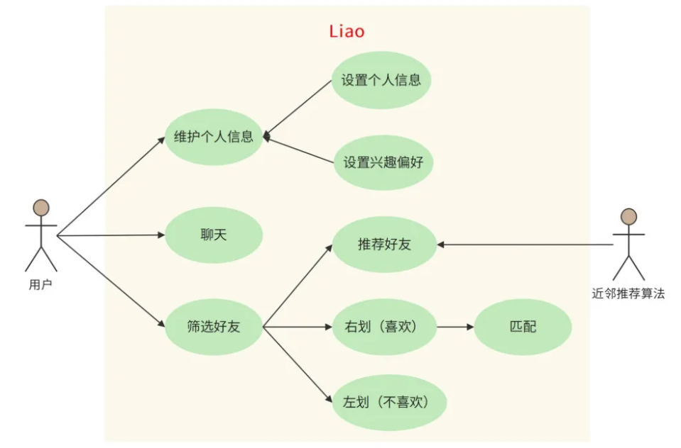
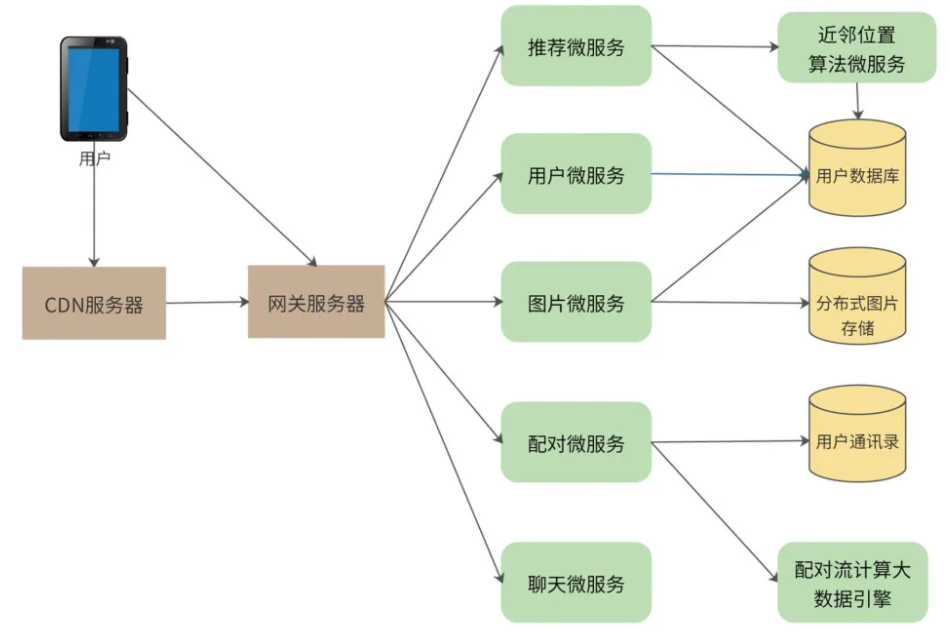
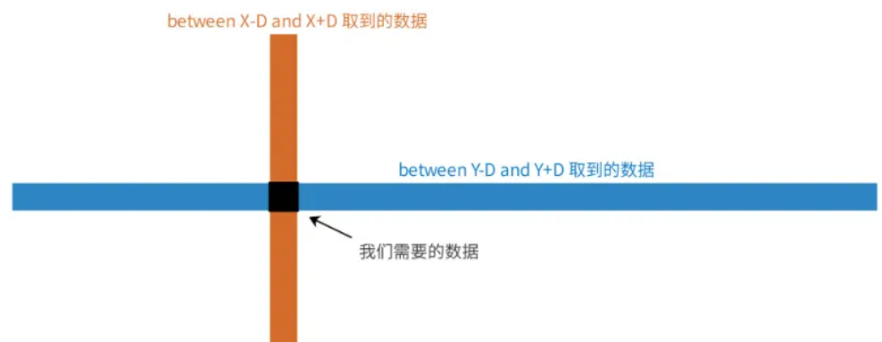
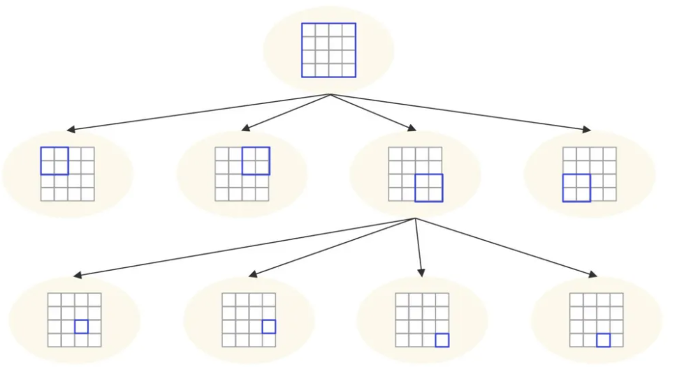
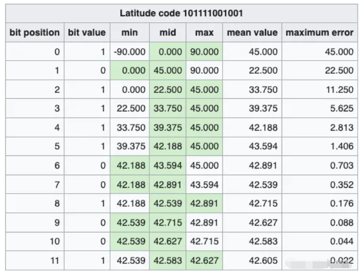
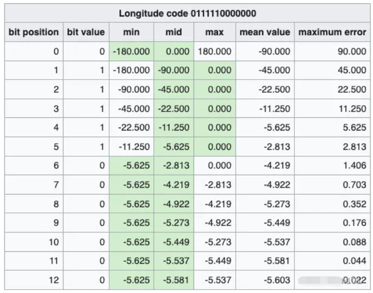
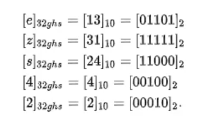

# 需要设计一款基于 LBS 的交友系统，如何设
计地理空间邻近算法
:::info
<font style="color:rgb(77, 77, 77);">交友与婚恋是人们最基本的需求之一。随着互联网时代的不断发展，移动社交软件已经成为了人们生活中必不可少的一部分。然而，熟人社交并不能完全满足年轻人的社交与情感需求，于是陌生人交友平台悄然兴起。</font>
<font style="color:rgb(77, 77, 77);">我们决定开发一款基于地理位置服务（LBS）的应用，为用户匹配邻近的、互相感兴趣的好友，应用名称为“Liao”。</font>
<font style="color:rgb(77, 77, 77);">Liao面临的技术挑战包括：面对海量的用户，如何为其快速找到邻近的人，可以选择的地理空间邻近算法有哪些？Liao如何在这些算法中选择出最合适的那个？</font>
:::
### **<font style="color:rgb(79, 79, 79);">1 需求分析</font>**
<font style="color:rgb(77, 77, 77);">Liao的客户端是一个移动App，用户打开App后，上传、编辑自己的基本信息，然后系统（推荐算法）根据其地理位置和个人信息，为其推荐位置邻近的用户。用户在手机上查看对方的照片和资料，如果感兴趣，希望进一步联系，就向右滑动照片；如果不感兴趣，就向左滑动照片。</font>
<font style="color:rgb(77, 77, 77);">如果两个人都向右滑动了对方，就表示他们互相感兴趣。系统就通知他们配对成功，并为他们开启聊天功能，可以更进一步了解对方，决定是否建立更深入的关系。</font>
<font style="color:rgb(77, 77, 77);">Liao的功能用例图如下。</font>

**<font style="color:rgb(77, 77, 77);">用户规模分析</font>**
<font style="color:rgb(77, 77, 77);">Liao的目标用户是全球范围内的中青年单身男女，预估目标用户超过10亿，系统按10亿用户进行设计。</font>
### **<font style="color:rgb(79, 79, 79);">2 概要设计</font>**
<font style="color:rgb(77, 77, 77);">Liao的系统架构采用典型的</font>**<font style="color:rgb(77, 77, 77);">微服务架构</font>**<font style="color:rgb(77, 77, 77);">设计方案，用户通过网关服务器访问具体的微服务，如下图。</font>

<font style="color:rgb(77, 77, 77);">由上图可知，首先，用户所有请求都通过统一的</font>**<font style="color:rgb(77, 77, 77);">网关服务器</font>**<font style="color:rgb(77, 77, 77);">处理。网关服务器负责限流、防攻击、用户身份识别及权限验证、微服务调用及数据聚合封装等，而真正的业务逻辑则通过访问微服务来完成。Liao的关键微服务有：用户微服务、图片微服务、配对微服务、聊天微服务、推荐微服务、邻近算法微服务等。Liao的网关预计将承担每天百亿次规模的访问压力。</font>
**<font style="color:rgb(77, 77, 77);">用户微服务</font>**<font style="color:rgb(77, 77, 77);">管理用户的个人信息、兴趣爱好以及交友偏好等，此外也负责用户登录服务，只有登录用户才能访问系统。因为需要存储十亿条用户数据，所以用户数据库采用分片的MySQL数据库。</font>
**<font style="color:rgb(77, 77, 77);">图片微服务</font>**<font style="color:rgb(77, 77, 77);">用于管理用户照片，提供用户照片存储及展示的功能。Liao需要存储的图片数大约几百亿张。我们使用Nginx作为图片服务器，图片服务器可以线性扩容，每写满一台服务器（及其Slave服务器），就继续写入下一台服务器。服务器IP、图片路径则记录在用户数据库中。同时，购买CDN服务，缓存热门的用户照片。</font>
**<font style="color:rgb(77, 77, 77);">配对</font>**<font style="color:rgb(77, 77, 77);">微</font>**<font style="color:rgb(77, 77, 77);">服务</font>**<font style="color:rgb(77, 77, 77);">负责将互相喜欢的用户配对，通知用户，并加入彼此的通讯录中。用户每次右划操作都调用该微服务。系统设置一个用户每天可以喜欢（右划）的人是有上限的，但是，对于活跃用户而言，长期积累下来，喜欢的人的数量还是非常大的，因此配对微服务会将数据发送给一个流式大数据引擎进行计算。</font>
**<font style="color:rgb(77, 77, 77);">推荐微服务</font>**<font style="color:rgb(77, 77, 77);">负责向用户展示其可能感兴趣的、邻近的用户。因此，一方面，推荐微服务需要根据用户操作、个人兴趣、交友偏好调用协同过滤等推荐算法进行推荐，另一方面必须保证推荐的用户在当前用户的附近。</font>
### **<font style="color:rgb(79, 79, 79);">3 详细设计</font>**
<font style="color:rgb(77, 77, 77);">详细设计主要关注邻近位置算法，也就是，如何根据用户的地理位置寻找距其一定范围内的其他用户。</font>
<font style="color:rgb(77, 77, 77);">我们可以通过Liao App获取用户当前经、纬度坐标，然后根据经、纬度，计算两个用户之间的距离，距离计算公式采用半正矢公式：</font>

<font style="color:rgb(77, 77, 77);">其中 r 代表地球半径，</font><font style="color:rgb(77, 77, 77);">s</font><font style="color:rgb(77, 77, 77);">m</font><font style="color:rgb(77, 77, 77);">a</font><font style="color:rgb(77, 77, 77);">l</font><font style="color:rgb(77, 77, 77);">l</font><font style="color:rgb(77, 77, 77);">v</font><font style="color:rgb(77, 77, 77);">a</font><font style="color:rgb(77, 77, 77);">r</font><font style="color:rgb(77, 77, 77);">p</font><font style="color:rgb(77, 77, 77);">h</font><font style="color:rgb(77, 77, 77);">i</font><font style="color:rgb(77, 77, 77);">𝑠</font><font style="color:rgb(77, 77, 77);">𝑚</font><font style="color:rgb(77, 77, 77);">𝑎</font><font style="color:rgb(77, 77, 77);">𝑙</font><font style="color:rgb(77, 77, 77);">𝑙</font><font style="color:rgb(77, 77, 77);">𝑣</font><font style="color:rgb(77, 77, 77);">𝑎</font><font style="color:rgb(77, 77, 77);">𝑟</font><font style="color:rgb(77, 77, 77);">𝑝</font><font style="color:rgb(77, 77, 77);">ℎ</font><font style="color:rgb(77, 77, 77);">𝑖</font><font style="color:rgb(77, 77, 77);">表示纬度，</font><font style="color:rgb(77, 77, 77);">s</font><font style="color:rgb(77, 77, 77);">m</font><font style="color:rgb(77, 77, 77);">a</font><font style="color:rgb(77, 77, 77);">l</font><font style="color:rgb(77, 77, 77);">l</font><font style="color:rgb(77, 77, 77);">l</font><font style="color:rgb(77, 77, 77);">a</font><font style="color:rgb(77, 77, 77);">m</font><font style="color:rgb(77, 77, 77);">b</font><font style="color:rgb(77, 77, 77);">d</font><font style="color:rgb(77, 77, 77);">a</font><font style="color:rgb(77, 77, 77);">𝑠</font><font style="color:rgb(77, 77, 77);">𝑚</font><font style="color:rgb(77, 77, 77);">𝑎</font><font style="color:rgb(77, 77, 77);">𝑙</font><font style="color:rgb(77, 77, 77);">𝑙</font><font style="color:rgb(77, 77, 77);">𝑙</font><font style="color:rgb(77, 77, 77);">𝑎</font><font style="color:rgb(77, 77, 77);">𝑚</font><font style="color:rgb(77, 77, 77);">𝑏</font><font style="color:rgb(77, 77, 77);">𝑑</font><font style="color:rgb(77, 77, 77);">𝑎</font><font style="color:rgb(77, 77, 77);">表示经度。</font>
<font style="color:rgb(77, 77, 77);">但是，当我们有10亿用户的时候，如果每次进行当前用户匹配都要和其他所有用户做一次距离计算，然后再进行排序，那么需要的计算量至少也是千亿级别，这样的计算量是我们不能承受的。通常的空间邻近算法有以下4种，我们一一进行分析，最终选择出最合适的方案。</font>
#### **<font style="color:rgb(79, 79, 79);">3.1 SQL邻近算法</font>**
<font style="color:rgb(77, 77, 77);">我们可以将用户经、纬度直接记录到数据库中，纬度记录在latitude字段，经度记录在longitude字段，用户当前的纬度和经度为X，Y，如果我们想要查找和当前用户经、纬度距离D之内的其他用户，可以通过如下SQL实现。</font>
```sql
select*from users where latitude between X-D and X+D and longitude between Y-D and Y+D;
```
<font style="color:rgb(77, 77, 77);">这样的SQL实现起来比较简单，但是如果有十亿用户，数据分片在几百台服务器上，SQL执行效率就会很低。而且我们用经、纬度距离进行近似计算，在高纬度地区，这种近似计算的偏差还是非常大的。</font>
<font style="color:rgb(77, 77, 77);">同时“between X-D and X+D”以及“between Y-D and Y+D”也会产生大量中间计算数据，这两个betwen会先返回经度和纬度各自区间内的所有用户，再进行交集and处理，如下图。</font>

<font style="color:rgb(77, 77, 77);">我们的用户量非常大，而计算邻近好友又是一个非常高频的访问，同时，分片数据库进行集合计算需要在中间代理服务器或应用程序服务器完成计算，因此，这样的交集计算带来计算负载压力是我们的系统完全不能承受的。所以这个方案可以被放弃。</font>
#### **<font style="color:rgb(79, 79, 79);">3.2 地理网格邻近算法</font>**
<font style="color:rgb(77, 77, 77);">为了减少上述交集计算使用的中间数据量，我们将整个地球用网格进行划分，如下图。</font>

<font style="color:rgb(77, 77, 77);">事实上，我们划分的网格远比图中示意的要密集得多，赤道附近，经、纬度方向每10公里一个网格。</font>
<font style="color:rgb(77, 77, 77);">这样每个用户必然会落入到一个网格中，我们在用户表中记录用户所在的网格ID（gridID），然后借助这个字段进行辅助查找，将查找范围限制在用户所在的网格（gridIDx0）及其周围8个网格（gridIDx1 ~ gridIDx8）中，可以极大降低中间数据量，SQL如下。</font>
```sql
select*from users where latitude between X-D and X+D and longitude between Y-D and Y+D and gridID in (gridIDx0,gridIDx1,gridIDx2,gridIDx3,gridIDx4,gridIDx5,gridIDx6,gridIDx7,gridIDx8);
```
<font style="color:rgb(77, 77, 77);">这条SQL要比上面SQL的计算负载压力小得多，但是对于高频访问的分片数据库而言，用这样的SQL进行邻近好友查询依然是不能承受的，同样距离精度也不满足要求。</font>
<font style="color:rgb(77, 77, 77);">但是基于这种网格设计思想，我们发现，我们可以不通过数据库就能实现邻近好友查询：我们可以</font>**<font style="color:rgb(77, 77, 77);">将所有的网格及其包含的用户都记录在内存中</font>**<font style="color:rgb(77, 77, 77);">。当我们进行邻近查询时，只需要在内存中计算用户及其邻近的8个网格内的所有用户的距离即可。</font>
<font style="color:rgb(77, 77, 77);">我们可以估算下所有用户经、纬度都加载到内存中需要的内存量：</font><font style="color:rgb(77, 77, 77);">s</font><font style="color:rgb(77, 77, 77);">m</font><font style="color:rgb(77, 77, 77);">a</font><font style="color:rgb(77, 77, 77);">l</font><font style="color:rgb(77, 77, 77);">l</font><font style="color:rgb(77, 77, 77);">1</font><font style="color:rgb(77, 77, 77);">G</font><font style="color:rgb(77, 77, 77);">t</font><font style="color:rgb(77, 77, 77);">i</font><font style="color:rgb(77, 77, 77);">m</font><font style="color:rgb(77, 77, 77);">e</font><font style="color:rgb(77, 77, 77);">s</font><font style="color:rgb(77, 77, 77);">3</font><font style="color:rgb(77, 77, 77);">t</font><font style="color:rgb(77, 77, 77);">i</font><font style="color:rgb(77, 77, 77);">m</font><font style="color:rgb(77, 77, 77);">e</font><font style="color:rgb(77, 77, 77);">s</font><font style="color:rgb(77, 77, 77);">4</font><font style="color:rgb(77, 77, 77);">B</font><font style="color:rgb(77, 77, 77);">=</font><font style="color:rgb(77, 77, 77);">12</font><font style="color:rgb(77, 77, 77);">G</font><font style="color:rgb(77, 77, 77);">B</font><font style="color:rgb(77, 77, 77);">𝑠</font><font style="color:rgb(77, 77, 77);">𝑚</font><font style="color:rgb(77, 77, 77);">𝑎</font><font style="color:rgb(77, 77, 77);">𝑙</font><font style="color:rgb(77, 77, 77);">𝑙</font><font style="color:rgb(77, 77, 77);">1</font><font style="color:rgb(77, 77, 77);">𝐺</font><font style="color:rgb(77, 77, 77);">𝑡</font><font style="color:rgb(77, 77, 77);">𝑖</font><font style="color:rgb(77, 77, 77);">𝑚</font><font style="color:rgb(77, 77, 77);">𝑒</font><font style="color:rgb(77, 77, 77);">𝑠</font><font style="color:rgb(77, 77, 77);">3</font><font style="color:rgb(77, 77, 77);">𝑡</font><font style="color:rgb(77, 77, 77);">𝑖</font><font style="color:rgb(77, 77, 77);">𝑚</font><font style="color:rgb(77, 77, 77);">𝑒</font><font style="color:rgb(77, 77, 77);">𝑠</font><font style="color:rgb(77, 77, 77);">4</font><font style="color:rgb(77, 77, 77);">𝐵</font><font style="color:rgb(77, 77, 77);">=</font><font style="color:rgb(77, 77, 77);">12</font><font style="color:rgb(77, 77, 77);">𝐺</font><font style="color:rgb(77, 77, 77);">𝐵</font><font style="color:rgb(77, 77, 77);">（用户ID、经度、纬度，都采用4个字节编码，总用户数1G）。这个内存量是完全可以接受的。</font>
<font style="color:rgb(77, 77, 77);">实际上，通过恰当地选择网格的大小，我们不停访问当前用户位置周边的网格就可以由近及远不断得到邻近的其他用户，而不需要再通过SQL来得到。那么如何选择网格大小？如何根据用户位置得到其所在的网格？又如何得到当前用户位置周边的其他网格呢？我们看下实践中更常用的动态网格和GeoHash算法。</font>
#### **<font style="color:rgb(79, 79, 79);">3.3 动态网格算法</font>**
<font style="color:rgb(77, 77, 77);">事实上，不管如何选择网格大小，可能都不合适。因为在陆家嘴即使很小的网格可能就包含近百万的用户，而在可可西里，非常大的网格也包含不了几个用户。</font>
<font style="color:rgb(77, 77, 77);">因此，我们希望能够动态设定网格的大小，如果一个网格内用户太多，就把它分裂成几个小网格，小网格内如果用户还是太多，继续分裂更小的网格，如下图。</font>

<font style="color:rgb(77, 77, 77);">这是一个四叉树网格结构，开始的时候整个地球只有一个网格，当用户增加，超过阈值（500个用户）的时候，就分裂出4个子树，4个子树对应父节点网格的4个地理子网格。同时，将用户根据位置信息重新分配到4个子树中。同样，如图中所示，如果某个子树中的用户增加，超过了阈值，该子树继续分裂成4个子树。</font>
<font style="color:rgb(77, 77, 77);">因此，我们可以将全球用户分配在这样一个4叉树网格结构中，所有的用户都必然在这个4叉树的叶子节点中，而且每个节点内包含的用户数不超过500个。那么，陆家嘴的网格可能就会很小，而可可西里的网格就会很大，太平洋对应的网格可能有几千公里。</font>
<font style="color:rgb(77, 77, 77);">当给定当前用户的经、纬度，查询邻近用户的时候，首先从根节点开始查找，如果根节点就是叶子节点，那么直接遍历根节点中的所有用户，计算距离即可。如果根节点不是叶子节点，那么根据给定的经、纬度判断其在网格中的位置，左上、右上、右下、左下，4个位置，顺序对应4个子树，根据网格位置访问对应的子树。如果子树是叶子节点，那么在叶子节点中查找，如果不是叶子节点，继续上面的过程，直到叶子节点。</font>
<font style="color:rgb(77, 77, 77);">上面的过程只能找到当前用户所在网格的好友，如何查找邻近网格的其他用户呢？事实上，我们只需要将4叉树所有的叶子节点顺序组成一个双向链表，每个节点在链表上的若干个前驱和后继节点正好就是其地理位置邻近的节点。</font>
<font style="color:rgb(77, 77, 77);">动态网格也叫4叉树网格，在空间邻近算法中较为常用，也能满足Liao的需求。但是编程实现稍稍有点麻烦，而且如果网格大小设计不合适，导致树的高度太高，每次查找需要遍历的路径太长，性能结果也比较差。我们再看下性能和灵活性更好的GeoHash算法。</font>
#### **<font style="color:rgb(79, 79, 79);">3.4 GeoHash算法</font>**
<font style="color:rgb(77, 77, 77);">除了动态网格算法，GeoHash事实上是另外一种变形了的网格算法，同时也是Redis中Geo函数使用的算法。GeoHash是将网格进行编码，然后根据编码进行Hash存储的一种算法。</font>
<font style="color:rgb(77, 77, 77);">经、纬度数字的不同精度，意味着经、纬度的误差范围，比如保留经、纬度到小数点后第1位，那么误差范围最大可能会达到11公里（在赤道附近）。也就是说，小数点后1位精度的经、纬度，其覆盖范围是一个11km * 11km的网格。</font>
<font style="color:rgb(77, 77, 77);">那么，我们用小数点后1位精度的经、纬度做key，网格内的用户集合做value，就可以构建一个Hash表的<key, value="" style="box-sizing: inherit;">对。通过查找这个KV对及其周围8个网格的KV对，计算这些value内所有用户和当前用户的距离，就可以找到邻近11公里内的所有用户。</font>
<font style="color:rgb(77, 77, 77);">实践中，redis的GeoHash并不会直接用经、纬度做key，而是采用一种基于Z阶曲线的编码方式，将二维的经、纬度，转化为一维的二进制数字，再进行base32编码，具体过程如下。</font>
<font style="color:rgb(77, 77, 77);">首先，分别针对经度和纬度，求取当前区间（对于纬度而言，开始的区间就是[-90, 90], 对于经度而言，开始区间就是[-180, 180]）的平均值，将当前区间分为两个区间。然后用用户的经、纬度和区间平均值进行比较，用户经、纬度必然落在两个区间中的一个，如果大于平均值，那么取1，如果小于平均值，那么取0。继续求取当前区间的平均值，进一步将当前区间分为两个区间。如此不断重复，可以在经度和纬度方向上，得到两个二进制数。这个二进制数越长，其所在的区间越小，精度越高。</font>
<font style="color:rgb(77, 77, 77);">下图表示经、纬度<42.60411, -5.59041>的二进制编码过程，最终得到纬度12位编码，经度13位编码。</font>


<font style="color:rgb(77, 77, 77);">得到两个二进制数后，再将它们合并成一个二进制数。合并规则是，从第一位开始，奇数位为经度，偶数位为纬度，上面例子合并后的结果为 01101 11111 11000 00100 00010 ，共25位二进制数。</font>
<font style="color:rgb(77, 77, 77);">将25位二进制数划分成5组，每组5个二进制数，对应的10进制数是0-31，采用Base32编码，可以得到一个5位字符串，Base32编码表如下。</font>

<font style="color:rgb(77, 77, 77);">编码计算过程如下。</font>

<font style="color:rgb(77, 77, 77);">最后得到一个字符串“ezs42”，作为Hash表的key。25位二进制的GeoHash编码，其误差范围大概2.4公里，即对应一个</font><font style="color:rgb(77, 77, 77);">s</font><font style="color:rgb(77, 77, 77);">m</font><font style="color:rgb(77, 77, 77);">a</font><font style="color:rgb(77, 77, 77);">l</font><font style="color:rgb(77, 77, 77);">l</font><font style="color:rgb(77, 77, 77);">2.4</font><font style="color:rgb(77, 77, 77);">k</font><font style="color:rgb(77, 77, 77);">m</font><font style="color:rgb(77, 77, 77);">t</font><font style="color:rgb(77, 77, 77);">i</font><font style="color:rgb(77, 77, 77);">m</font><font style="color:rgb(77, 77, 77);">e</font><font style="color:rgb(77, 77, 77);">s</font><font style="color:rgb(77, 77, 77);">2.4</font><font style="color:rgb(77, 77, 77);">k</font><font style="color:rgb(77, 77, 77);">m</font><font style="color:rgb(77, 77, 77);">𝑠</font><font style="color:rgb(77, 77, 77);">𝑚</font><font style="color:rgb(77, 77, 77);">𝑎</font><font style="color:rgb(77, 77, 77);">𝑙</font><font style="color:rgb(77, 77, 77);">𝑙</font><font style="color:rgb(77, 77, 77);">2.4</font><font style="color:rgb(77, 77, 77);">𝑘</font><font style="color:rgb(77, 77, 77);">𝑚</font><font style="color:rgb(77, 77, 77);">𝑡</font><font style="color:rgb(77, 77, 77);">𝑖</font><font style="color:rgb(77, 77, 77);">𝑚</font><font style="color:rgb(77, 77, 77);">𝑒</font><font style="color:rgb(77, 77, 77);">𝑠</font><font style="color:rgb(77, 77, 77);">2.4</font><font style="color:rgb(77, 77, 77);">𝑘</font><font style="color:rgb(77, 77, 77);">𝑚</font><font style="color:rgb(77, 77, 77);">的网格。网格内的用户都作为value放入到Hash表中。</font>
<font style="color:rgb(77, 77, 77);">一般说来，通过选择GeoHash的编码长度，实现不同大小的网格，就可以满足我们邻近交友的应用场景了。但是在Redis中，需要面对更通用的地理位置计算场景，所以Redis中的GeoHash并没有用Hash表存储，而是用跳表存储。</font>
<font style="color:rgb(77, 77, 77);">Redis使用52位二进制的GeoHash编码，误差范围0.6米。Redis将编码后的二进制数按照Z阶曲线的布局，进行一维化展开。即将二维的经、纬度上的点，用一条Z型曲线连接起来，Z阶曲线布局示例如下图。</font>

<font style="color:rgb(77, 77, 77);">事实上，所谓的Z阶曲线布局，本质其实就是基于GeoHash的二进制排序。将这些经过编码的2进制数据用跳表存储。查找用户的时候，可以快速找到该用户，沿着跳表前后检索，得到的就是邻近的用户。</font>
#### **<font style="color:rgb(79, 79, 79);">3.5 Liao的最终算法选择</font>**
<font style="color:rgb(77, 77, 77);">Liao的邻近算法最终选择使用Hash表存储的GeoHash算法，经度采用13bit编码，纬度采用12bit编码，即最后的GeoHash编码5个字符，每个网格</font><font style="color:rgb(77, 77, 77);">s</font><font style="color:rgb(77, 77, 77);">m</font><font style="color:rgb(77, 77, 77);">a</font><font style="color:rgb(77, 77, 77);">l</font><font style="color:rgb(77, 77, 77);">l</font><font style="color:rgb(77, 77, 77);">4.9</font><font style="color:rgb(77, 77, 77);">k</font><font style="color:rgb(77, 77, 77);">m</font><font style="color:rgb(77, 77, 77);">t</font><font style="color:rgb(77, 77, 77);">i</font><font style="color:rgb(77, 77, 77);">m</font><font style="color:rgb(77, 77, 77);">e</font><font style="color:rgb(77, 77, 77);">s</font><font style="color:rgb(77, 77, 77);">4.9</font><font style="color:rgb(77, 77, 77);">k</font><font style="color:rgb(77, 77, 77);">m</font><font style="color:rgb(77, 77, 77);">a</font><font style="color:rgb(77, 77, 77);">p</font><font style="color:rgb(77, 77, 77);">p</font><font style="color:rgb(77, 77, 77);">r</font><font style="color:rgb(77, 77, 77);">o</font><font style="color:rgb(77, 77, 77);">x</font><font style="color:rgb(77, 77, 77);">25</font><font style="color:rgb(77, 77, 77);">k</font><font style="color:rgb(77, 77, 77);">m</font><font style="color:rgb(77, 77, 77);">2</font><font style="color:rgb(77, 77, 77);">𝑠</font><font style="color:rgb(77, 77, 77);">𝑚</font><font style="color:rgb(77, 77, 77);">𝑎</font><font style="color:rgb(77, 77, 77);">𝑙</font><font style="color:rgb(77, 77, 77);">𝑙</font><font style="color:rgb(77, 77, 77);">4.9</font><font style="color:rgb(77, 77, 77);">𝑘</font><font style="color:rgb(77, 77, 77);">𝑚</font><font style="color:rgb(77, 77, 77);">𝑡</font><font style="color:rgb(77, 77, 77);">𝑖</font><font style="color:rgb(77, 77, 77);">𝑚</font><font style="color:rgb(77, 77, 77);">𝑒</font><font style="color:rgb(77, 77, 77);">𝑠</font><font style="color:rgb(77, 77, 77);">4.9</font><font style="color:rgb(77, 77, 77);">𝑘</font><font style="color:rgb(77, 77, 77);">𝑚</font><font style="color:rgb(77, 77, 77);">𝑎</font><font style="color:rgb(77, 77, 77);">𝑝</font><font style="color:rgb(77, 77, 77);">𝑝</font><font style="color:rgb(77, 77, 77);">𝑟</font><font style="color:rgb(77, 77, 77);">𝑜</font><font style="color:rgb(77, 77, 77);">𝑥</font><font style="color:rgb(77, 77, 77);">25</font><font style="color:rgb(77, 77, 77);">𝑘</font><font style="color:rgb(77, 77, 77);">𝑚</font><font style="color:rgb(77, 77, 77);">2</font><font style="color:rgb(77, 77, 77);">，将整个地球分为</font><font style="color:rgb(77, 77, 77);">s</font><font style="color:rgb(77, 77, 77);">m</font><font style="color:rgb(77, 77, 77);">a</font><font style="color:rgb(77, 77, 77);">l</font><font style="color:rgb(77, 77, 77);">l</font><font style="color:rgb(77, 77, 77);">2</font><font style="color:rgb(77, 77, 77);">25</font><font style="color:rgb(77, 77, 77);">a</font><font style="color:rgb(77, 77, 77);">p</font><font style="color:rgb(77, 77, 77);">p</font><font style="color:rgb(77, 77, 77);">r</font><font style="color:rgb(77, 77, 77);">o</font><font style="color:rgb(77, 77, 77);">x</font><font style="color:rgb(77, 77, 77);">3300</font><font style="color:rgb(77, 77, 77);">万</font><font style="color:rgb(77, 77, 77);">𝑠</font><font style="color:rgb(77, 77, 77);">𝑚</font><font style="color:rgb(77, 77, 77);">𝑎</font><font style="color:rgb(77, 77, 77);">𝑙</font><font style="color:rgb(77, 77, 77);">𝑙</font><font style="color:rgb(77, 77, 77);">2</font><font style="color:rgb(77, 77, 77);">25</font><font style="color:rgb(77, 77, 77);">𝑎</font><font style="color:rgb(77, 77, 77);">𝑝</font><font style="color:rgb(77, 77, 77);">𝑝</font><font style="color:rgb(77, 77, 77);">𝑟</font><font style="color:rgb(77, 77, 77);">𝑜</font><font style="color:rgb(77, 77, 77);">𝑥</font><font style="color:rgb(77, 77, 77);">3300</font><font style="color:rgb(77, 77, 77);">万</font><font style="color:rgb(77, 77, 77);">个网格，去掉海洋和几乎无人生存的荒漠极地，需要存储的Hash键不到500万个，采用Hash表存储。Hash表的key是GeoHash编码，value是一个List，其中包含了所有相同GeoHash编码的用户ID。</font>
<font style="color:rgb(77, 77, 77);">查找邻近好友的时候，Liao将先计算用户当前位置的GeoHash值（5个字符），然后从Hash表中读取该Hash值对应的所有用户，即在同一个网格内的用户，进行匹配，将满足匹配条件的对象返回给用户。如果一个网格内匹配的对象数量不足，计算周围8个网格的GeoHash值，读取这些Hash值对应的用户列表，继续匹配。</font>
